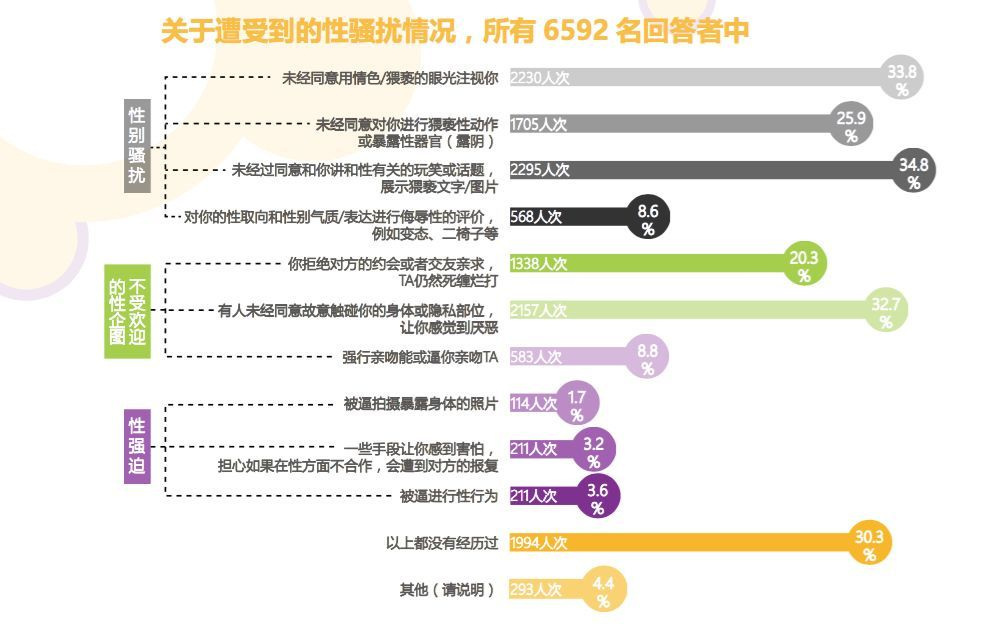

# 高校性侵事件记录
近年来，高校性侵事件频发，根据广州性别教育中心发布的《中国大学在校和毕业生性骚扰调查报告》，受访的6592份问卷里，有7成受过不同程度和不同形式的骚扰，然而将近一半的人会选择忍耐，报案比例更是不到4%。在询问为何不向学校投诉报告的3835名回答者里，有六成认为告诉学校也没用。

本仓库充分尊重当事人意愿，接受实名或匿名举报，并对信息进行一定的筛查，注意并不保证完全真实可信，但开放讨论。

请勇敢对性侵说不！帮助以后的同学远离禽兽导师！

## 概览
| 日期 | 学校（院） | 被举报人 | 举报人 | 标题（点击查看详情） | 备注 |
| :-: | :-: | :-: | :-: | :-: | :-: |
| 2017-5 | *北京电影学院 | 朱正明 | 阿廖沙 | [北京电影学院阿廖沙事件](2017/北京电影学院-阿廖沙事件/) | 被举报人为北影阿廖沙的班主任朱炯之父 |
| 2017-7 | 电子科技大学 | 张翼德 | “女权之声” | [电子科技大学张翼德事件](2017/电子科技大学-张翼德事件/) |  |
| 2017-12 | 南昌大学 | 周斌 | @喝咖啡的猫11 | [南昌大学国学院副院长长期性侵其女学](2017/南昌大学-周斌事件/) |  |
|  2018-1 | 北京航空航天大学 | 陈小武 | 罗茜茜 | [女博士罗茜茜实名举报长江学者陈小武性骚扰女学生](2018/北京航空航天大学-陈小武/) | [知乎-如何看待已毕业女博士罗茜茜实名举报性骚扰、北航长江学者陈小武被撤职？][知乎-陈小武] |

## Contributing
考虑到可能会存在恶意中伤诽谤等信息不实的情况，所以本仓库将秉着“欢迎投稿，欢迎探讨，欢迎辩护”的原则，会让子弹飞下去，请读者保持客观理性。

### 半实名
 - 注册一个github账户，或者联系已有账户的可靠朋友帮助
 - Fork本仓库后进行添加修改
 - 提交Pull request或开启issue进行讨论

### 匿名
 - 整理事件描述，相关报道/证据等
 - 发送到collegesexualassaultrecords@outlook.com

[知乎-陈小武]: https://www.zhihu.com/question/264917016/answer/287152583

## Reference
 - [Sexual-Assault-Case-China](https://github.com/Sexual-Assault-Protect/Sexual-Assault-Case-China)